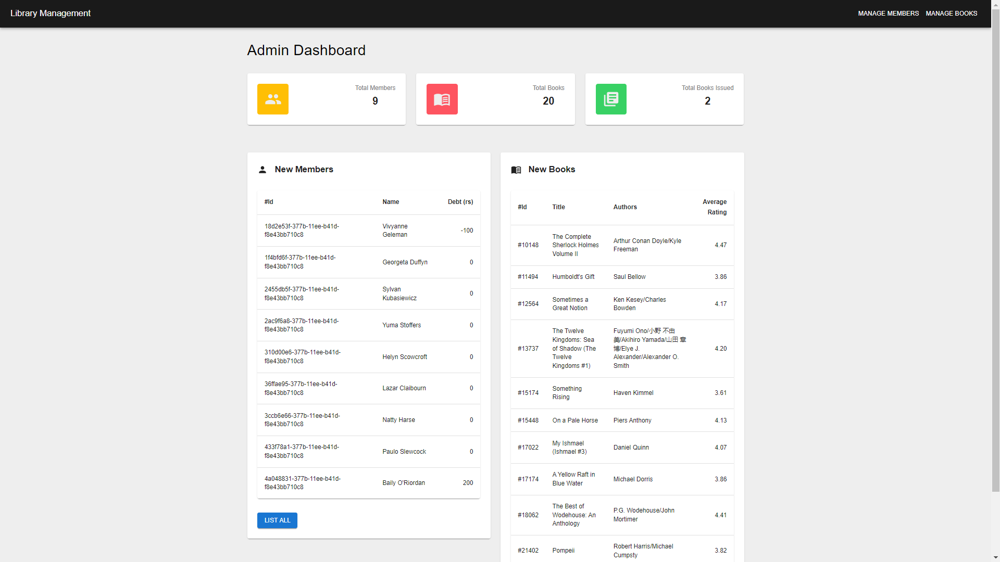
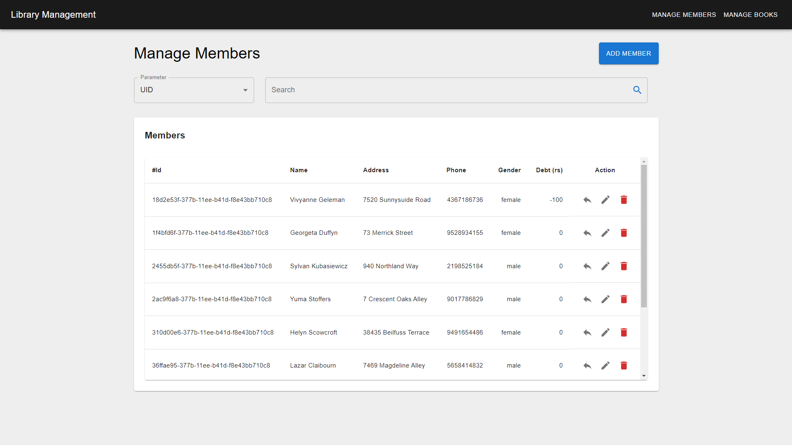
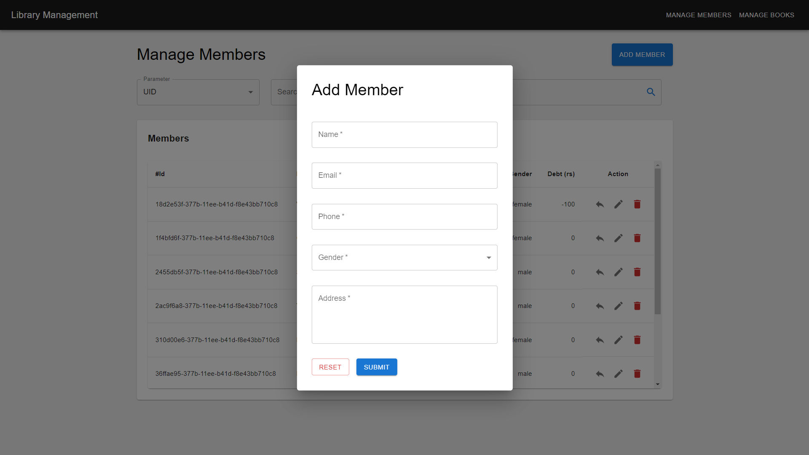
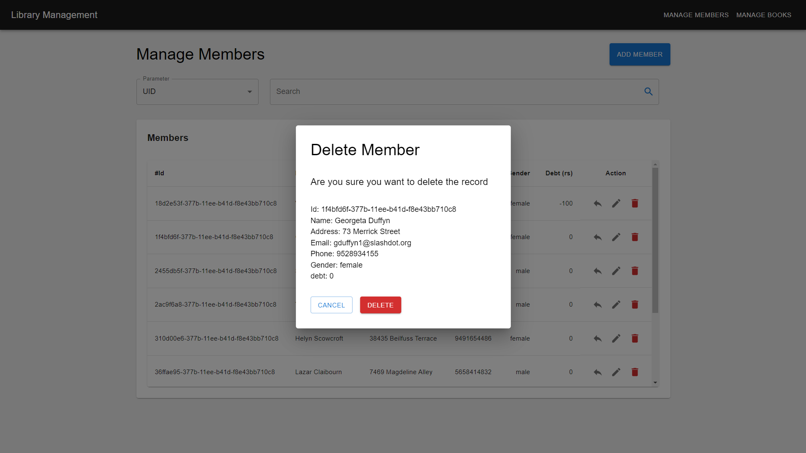
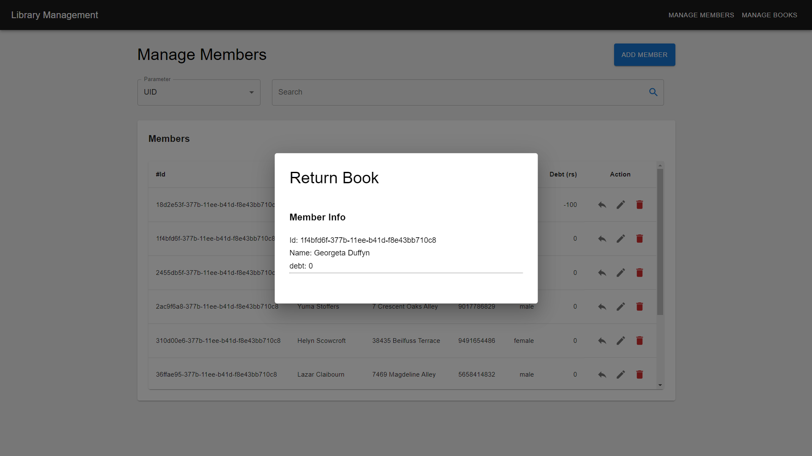
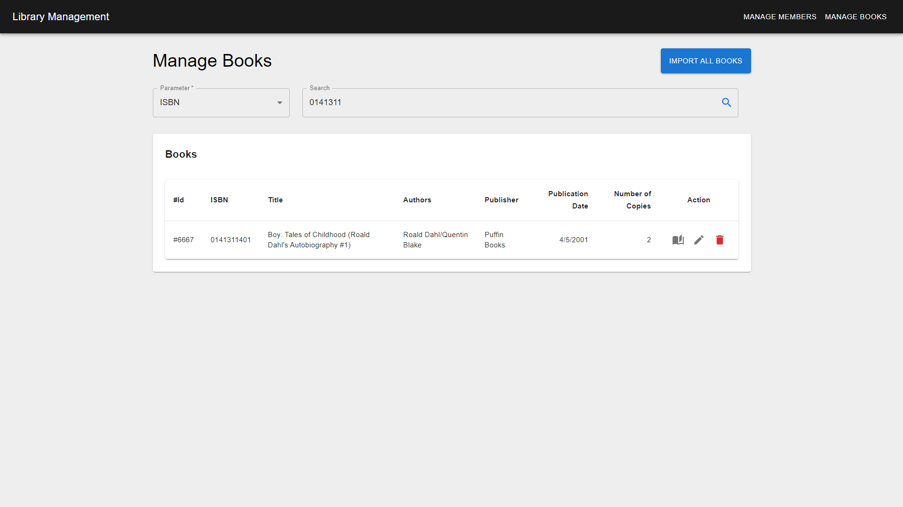
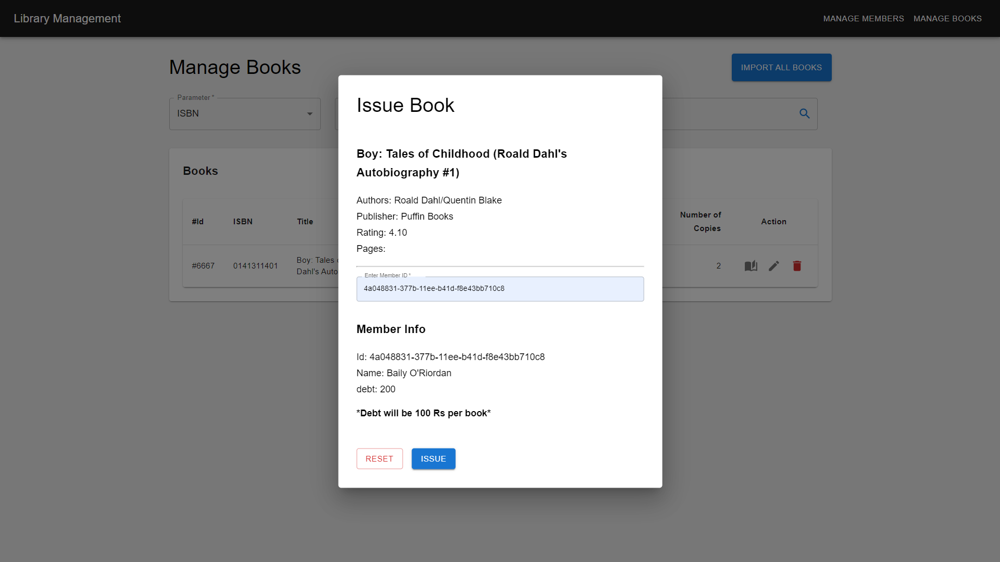
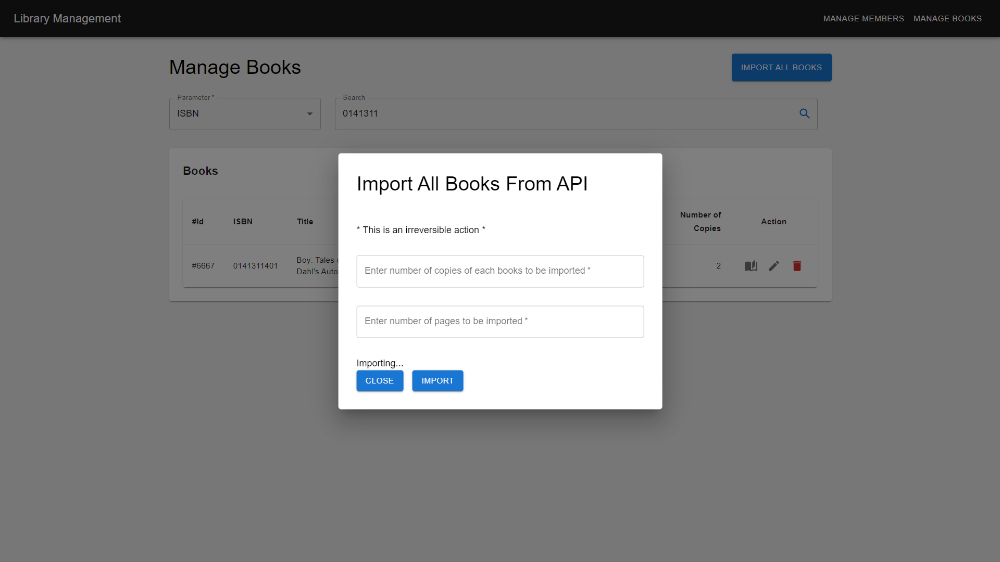

# Library Management System

## Table of Contents

- [Introduction](#introduction)
- [Features](#features)
- [Technologies Used](#technologies-used)
- [Screenshots](#screenshots)

## Introduction

The Library Management System is a web application designed to manage and organize library resources efficiently. It provides an easy-to-use interface for library staff to manage books, users, and borrowing records.

## Features

- Book Management: Add, update, and delete books in the library catalog.
- User Management: Manage library members and their borrowing history.
- Borrowing System: Record and manage book borrowings and returns.
- Search and Filters: Easily search for books and users with advanced filters.
- Responsive Design: Accessible and user-friendly interface for desktop and mobile devices.

## Technologies Used

- Frontend: React, Redux, MaterialUI
- Backend: Flask, SQLAlchemy, MySQL
- API Requests: Axios
- Version Control: Git

## Screenshots

Dashboard of the application

Manage members page

Manage members page

Delete member modal

Return book modal

Manage books page

Issue book modal

Import books from API

